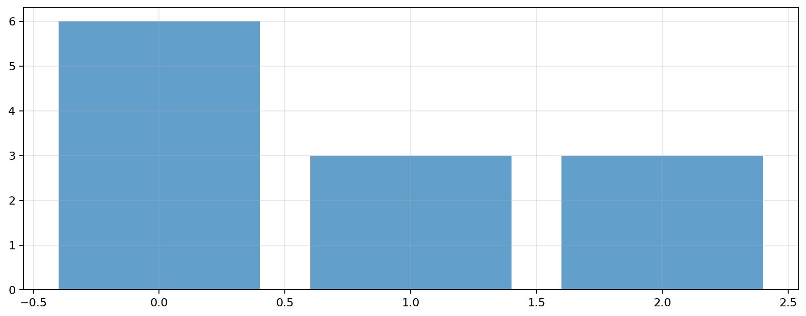
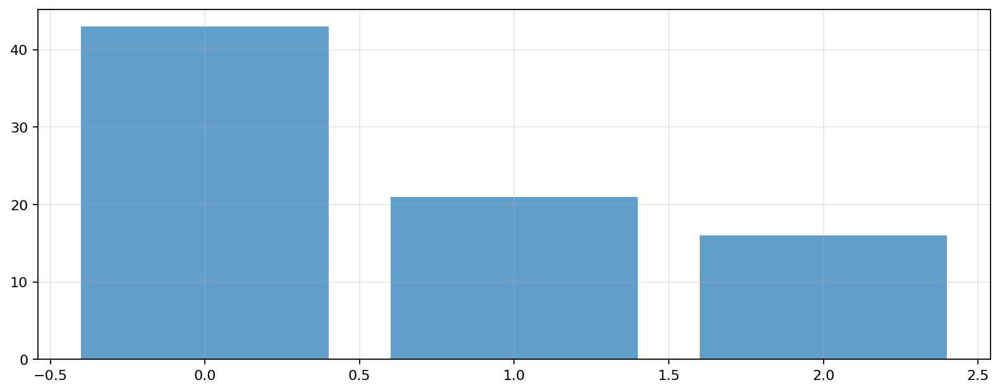

# Report

_Generated: 2026-03-13 05:39:45_

## Artifacts

- [bar_1.png](assets/bar_1.png)
- [bar_2.png](assets/bar_2.png)


---

# Engineering Team Dashboard

```text
*Composable connector example — Project + Team data joined together*
```

---

## Project Status

```text
*Data from ProjectConnector*
```



#### Table

| priority   |   count |
|:-----------|--------:|
| high       |       6 |
| medium     |       5 |
| low        |       1 |

_shape: 3 rows × 2 cols_

## Team Directory

```text
*Data from TeamConnector*
```

#### Table

| department     |   headcount |
|:---------------|------------:|
| Product        |           1 |
| Engineering    |           2 |
| Infrastructure |           1 |

_shape: 3 rows × 2 cols_

#### Table

| full_name   | role             | department     | location      |
|:------------|:-----------------|:---------------|:--------------|
| Bob Kumar   | Backend Engineer | Engineering    | New York      |
| Carol Zhang | QA Engineer      | Engineering    | San Francisco |
| Dave Wilson | DevOps Engineer  | Infrastructure | Remote        |
| Alice Chen  | Senior Designer  | Product        | San Francisco |

_shape: 4 rows × 4 cols_

---

## Cross-Connector Insights

```text
*Queries that span both connectors — only possible because they compose*
```

### Hours Logged by Department



#### Table

| department     |   total_hours |   contributors |
|:---------------|--------------:|---------------:|
| Engineering    |            43 |              2 |
| Infrastructure |            21 |              1 |
| Product        |            16 |              1 |

_shape: 3 rows × 3 cols_

### Task Completion by Role

#### Table

| role             |   total_tasks |   completed |   completion_pct |
|:-----------------|--------------:|------------:|-----------------:|
| QA Engineer      |             3 |           2 |             66.7 |
| Backend Engineer |             3 |           2 |             66.7 |
| Senior Designer  |             3 |           1 |             33.3 |
| DevOps Engineer  |             3 |           1 |             33.3 |

_shape: 4 rows × 4 cols_

### Estimate Accuracy by Department

#### Table

| department     |   estimated |   actual |   accuracy_pct |
|:---------------|------------:|---------:|---------------:|
| Product        |          24 |       16 |           66.7 |
| Infrastructure |          30 |       21 |           70   |
| Engineering    |          42 |       43 |          102.4 |

_shape: 3 rows × 4 cols_

### Workload by Team Member

#### Table

| full_name   | role             |   tasks_assigned |   hours_logged |   avg_hours_per_day |
|:------------|:-----------------|-----------------:|---------------:|--------------------:|
| Bob Kumar   | Backend Engineer |                3 |             84 |                  14 |
| Dave Wilson | DevOps Engineer  |                3 |             63 |                   9 |
| Alice Chen  | Senior Designer  |                3 |             48 |                   8 |
| Carol Zhang | QA Engineer      |                3 |             45 |                   9 |

_shape: 4 rows × 5 cols_

---

## Installed Connectors

### project

```text
Available widgets: Project Status, Time Tracking
```

```text
Entities: tasks, time_logs
```

### team

```text
Available widgets: Team Overview
```

```text
Entities: team_members
```

