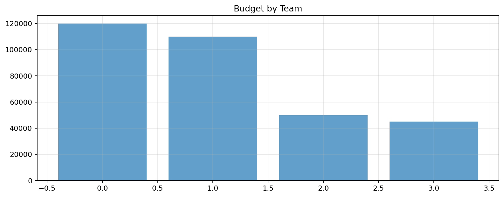
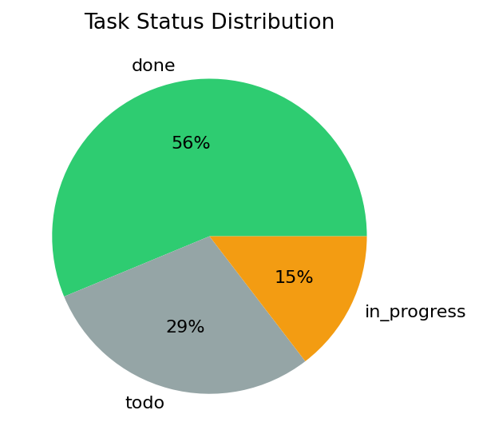
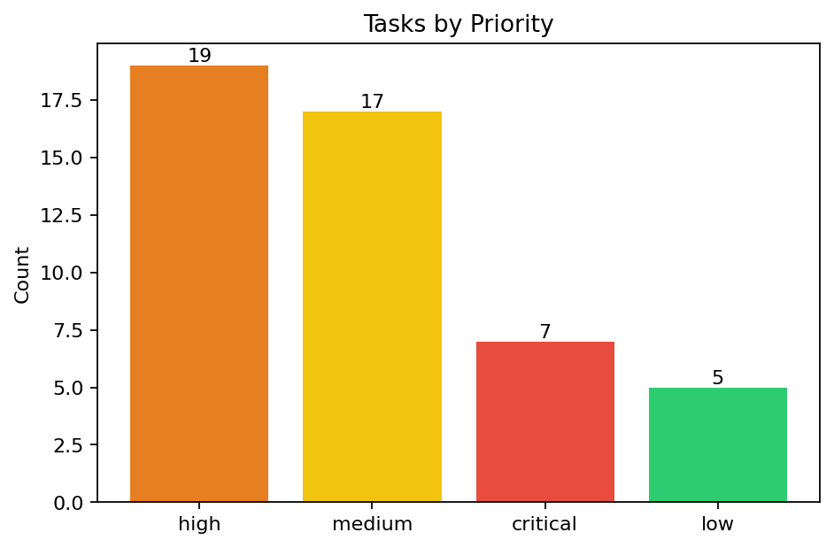
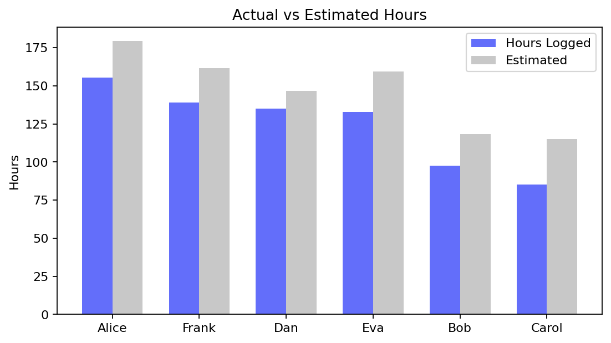
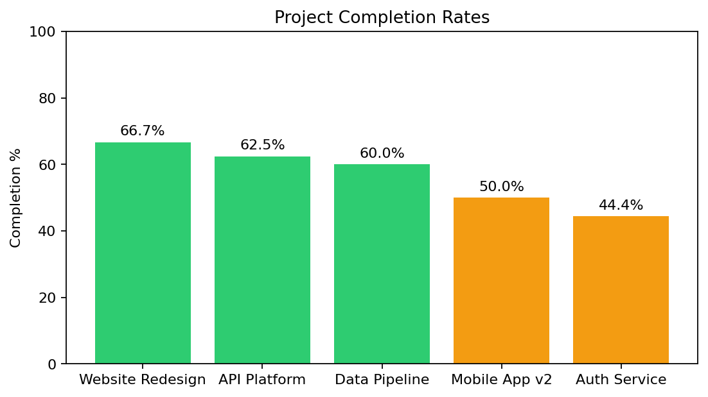
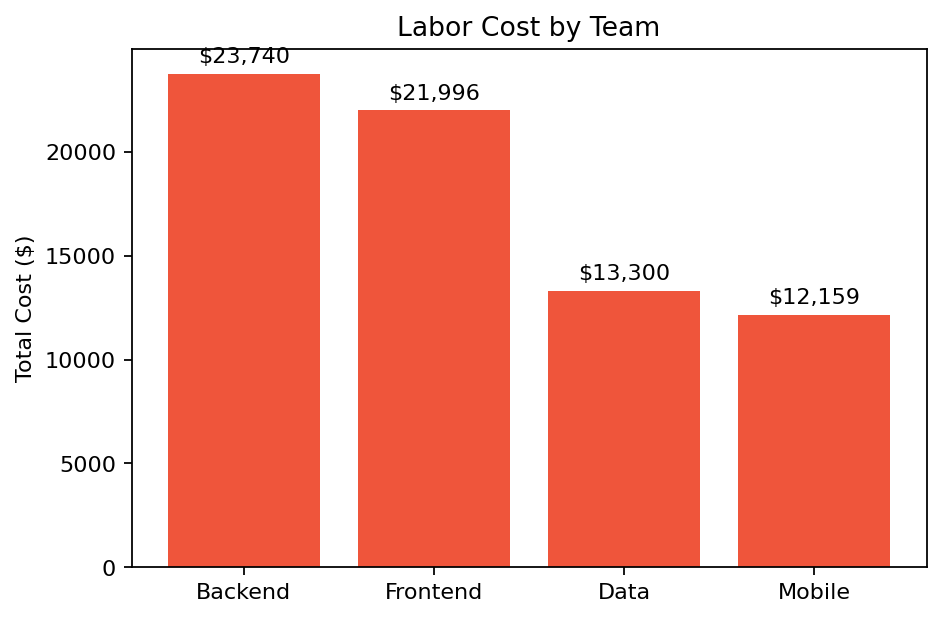

# Project Tracker Dashboard

_Generated: 2026-03-13 04:55:27_

## Artifacts

- [bar_1.png](assets/bar_1.png)
- [tasks_by_status.png](assets/tasks_by_status.png)
- [tasks_by_priority.png](assets/tasks_by_priority.png)
- [workload_by_assignee.png](assets/workload_by_assignee.png)
- [project_health.png](assets/project_health.png)
- [team_cost.png](assets/team_cost.png)

---

## Portfolio Overview

| **Projects** | **Total Budget** | **Tasks** | **Hours Logged** |
| :---: | :---: | :---: | :---: |
| **5** | **$325,000** | **48** | **745.3** |

---

## Budget by Team

*Budget by Team*

---

## Tasks by Status

*Task status distribution*

---

## Tasks by Priority

*Task count by priority level*

---

## Workload by Assignee

*Actual vs estimated hours by assignee*

---

## Project Health

*Project completion rates*

#### Project Details

| Project | Budget | Tasks | Done | Completion | Hours |
| --- | --- | --- | --- | --- | --- |
| Website Redesign | $50,000 | 9 | 6 | 66.7% | 165.6 |
| API Platform | $80,000 | 8 | 5 | 62.5% | 113.0 |
| Data Pipeline | $45,000 | 10 | 6 | 60.0% | 166.4 |
| Mobile App v2 | $120,000 | 12 | 6 | 50.0% | 220.9 |
| Auth Service | $30,000 | 9 | 4 | 44.4% | 79.4 |

_shape: 5 rows × 6 cols_

---

## Team Cost Analysis

*Total labor cost by team*

---

