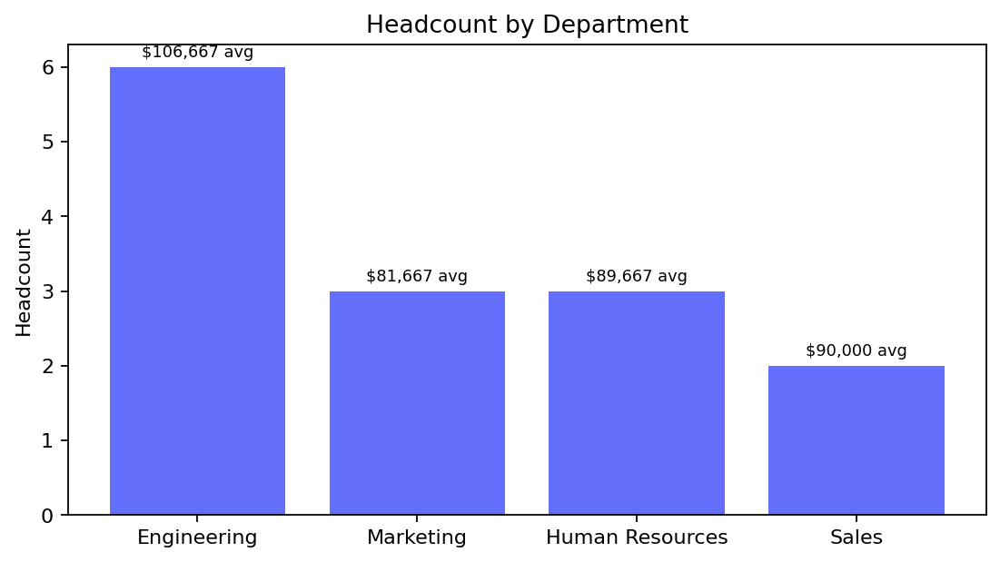
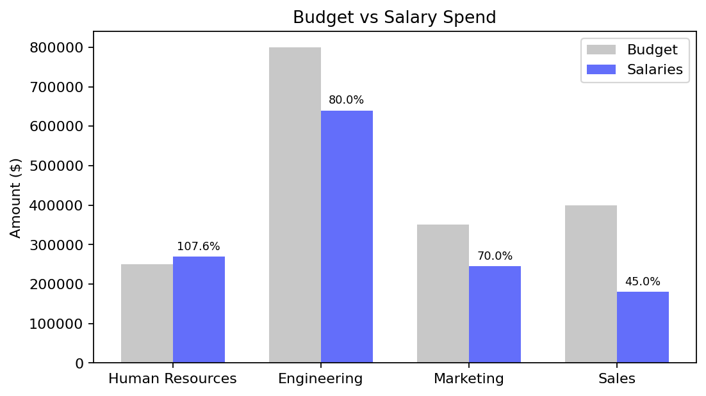
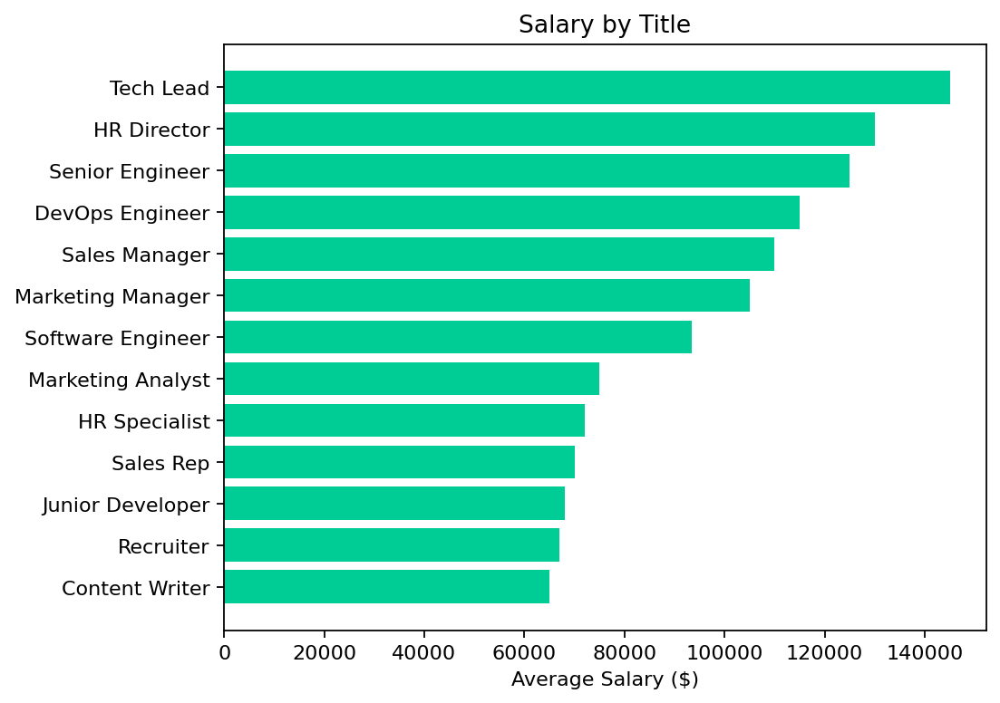
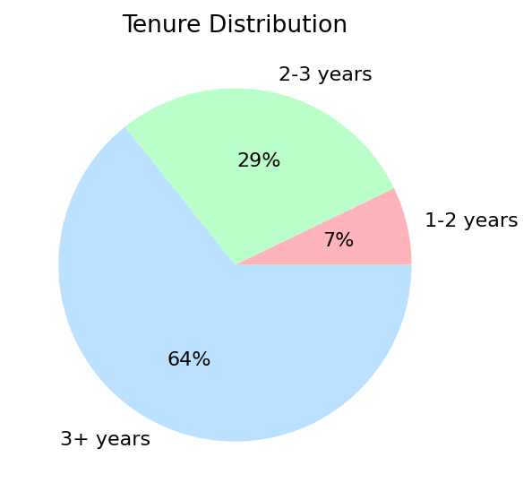

# HR Dashboard

_Generated: 2026-03-13 04:55:23_

## Artifacts

- [headcount_by_dept.png](assets/headcount_by_dept.png)
- [budget_utilization.png](assets/budget_utilization.png)
- [salary_by_title.png](assets/salary_by_title.png)
- [tenure_distribution.png](assets/tenure_distribution.png)

---

## Headcount Summary

| **Total Employees** | **Active** | **Terminated** | **Avg Salary** |
| :---: | :---: | :---: | :---: |
| **15** | **14** | **1** | **$93,600** |

---

## Headcount by Department

*Headcount and average salary by department*

---

## Department Budget Utilization

*Budget vs salary spend by department*

---

## Salary Distribution by Title

*Average salary by title*

---

## Tenure Distribution

*Employee tenure distribution*

---

## Recent Hires (Last 12 Months)

#### Recent Hires

| name   | department   | title   | hire_date   | salary   |
|--------|--------------|---------|-------------|----------|

_shape: 0 rows × 5 cols_

---

