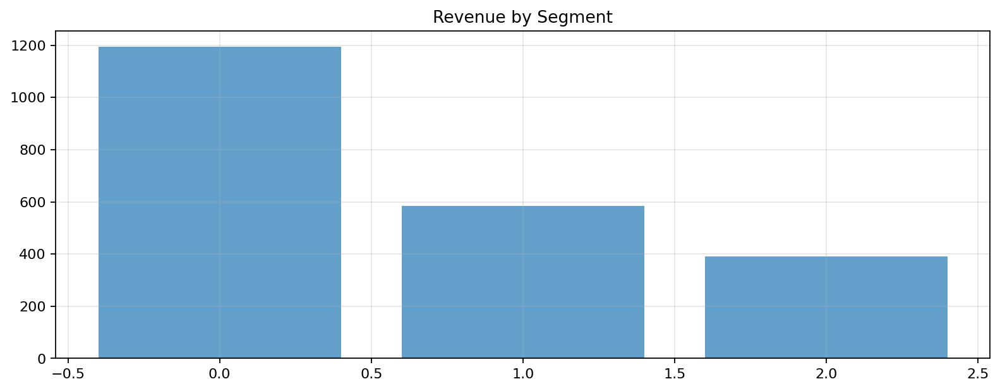
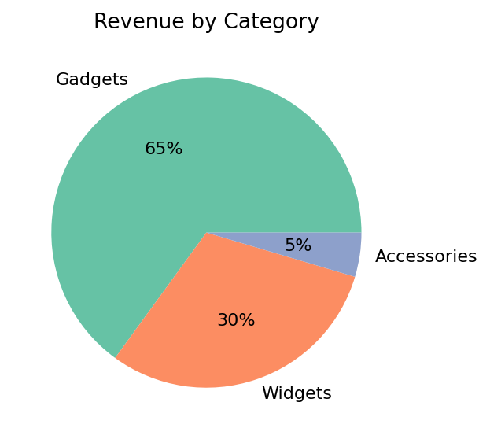
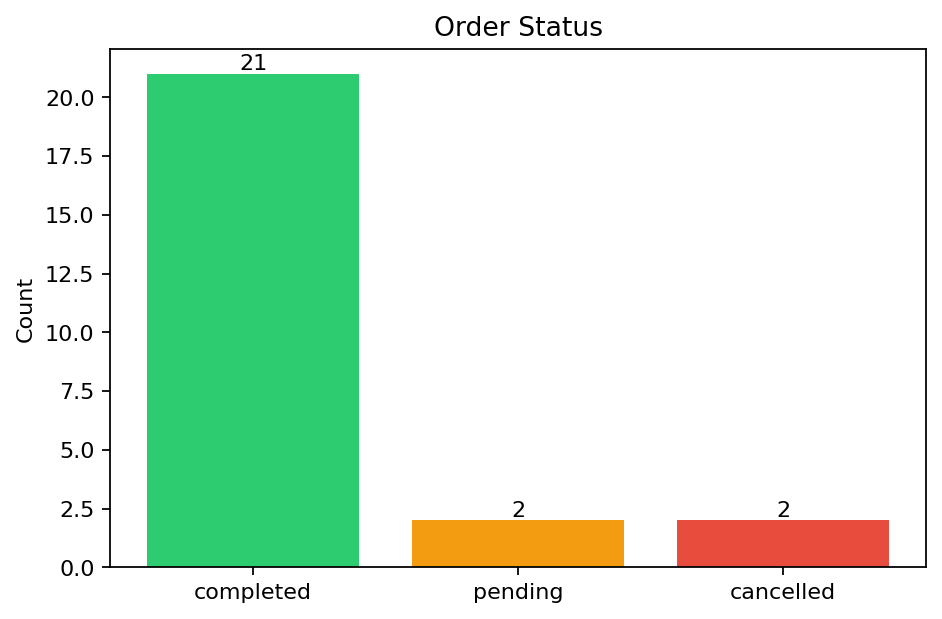
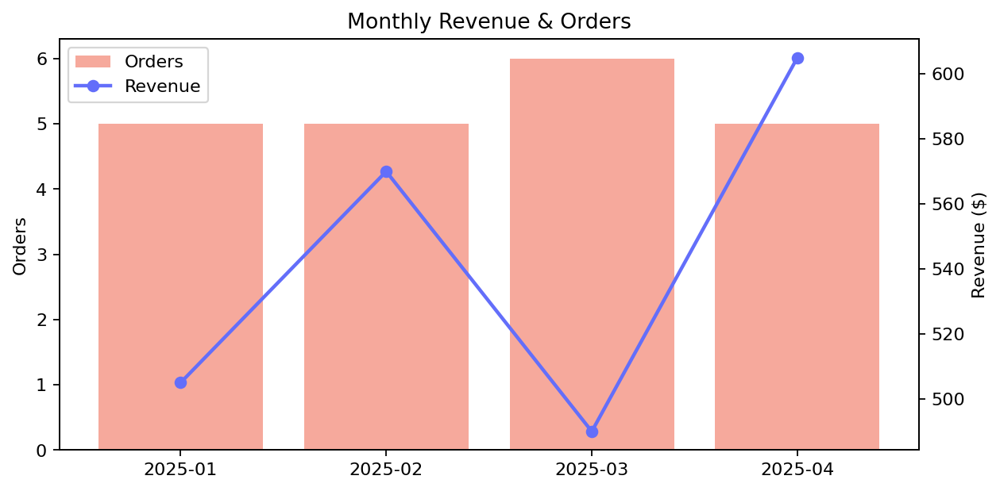
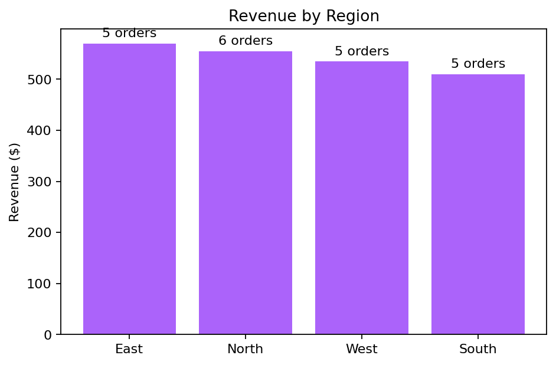

# Sales Analytics Dashboard

_Generated: 2026-03-13 04:55:22_

## Artifacts

- [bar_1.png](assets/bar_1.png)
- [revenue_by_category.png](assets/revenue_by_category.png)
- [order_status.png](assets/order_status.png)
- [monthly_trend.png](assets/monthly_trend.png)
- [regional_performance.png](assets/regional_performance.png)

---

## Key Metrics

| **Total Revenue** | **Orders** | **Avg Order Value** | **Units Sold** |
| :---: | :---: | :---: | :---: |
| **$2,424.58** | **25** | **$96.98** | **42** |

---

## Revenue by Customer Segment

*Revenue by Segment*

---

## Revenue by Product Category

*Revenue share by product category*

---

## Order Status

*Order count by status*

---

## Monthly Revenue Trend

*Monthly revenue and order trend*

---

## Top 5 Customers by Revenue

#### Top Customers

| name         | segment    |   total_revenue |   orders |
|:-------------|:-----------|----------------:|---------:|
| Carol Davis  | Enterprise |          339.92 |        3 |
| Frank Lee    | Enterprise |          289.97 |        2 |
| Leo Garcia   | Enterprise |          259.98 |        1 |
| Eva Martinez | SMB        |          249.96 |        2 |
| Bob Smith    | SMB        |          219.96 |        3 |

_shape: 5 rows × 4 cols_

---

## Regional Performance

*Revenue by region*

---

